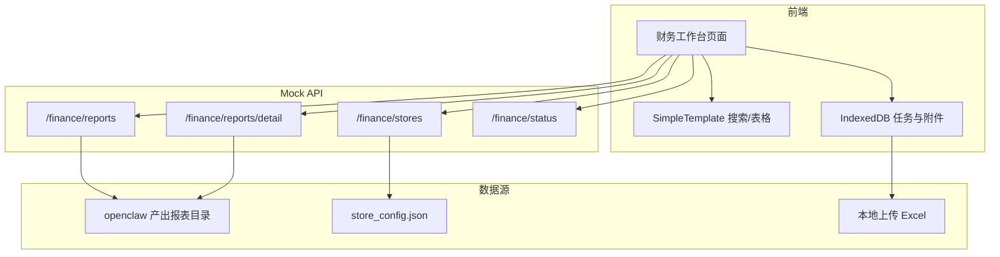
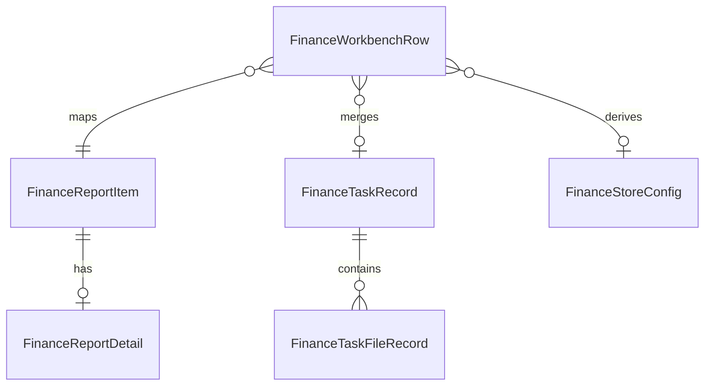
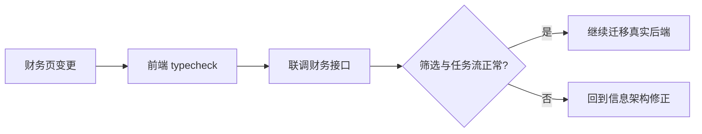

# 系统架构文档

## 文档信息
- **功能名称**：财务工作台筛选收敛审计
- **版本**：1.0
- **创建日期**：2026-04-01
- **作者**：Architect Agent

---

## 1. 架构概述

### 1.1 系统架构图



### 1.2 架构决策

| 决策 | 选项 | 选择 | 原因 |
|------|------|------|------|
| 列表页面框架 | 手写搜索栏 / `SimpleTemplate` | `SimpleTemplate` | 与项目其他列表页保持一致 |
| 月份筛选 | 前端本地过滤 / API 参数过滤 | API 参数过滤优先 | 这是报表主分区，天然适合在 API 层裁剪 |
| 状态类筛选 | API 过滤 / 本地派生过滤 | 本地派生过滤 | `任务状态 / 盈利状态 / 门店配置状态` 当前由前端聚合计算得到 |

---

## 2. 技术栈

| 层级 | 技术 | 版本 | 说明 |
|------|------|------|------|
| 前端框架 | Vue | 仓库现有版本 | 财务页实现 |
| UI 库 | Ant Design Vue + 自定义 Base 组件 | 仓库现有版本 | 列表、表单、弹窗 |
| 搜索/表格模板 | `SimpleTemplate` | 仓库现有版本 | 统一搜索区与表格区 |
| 数据存储 | IndexedDB | 浏览器原生 | 财务任务与上传附件本地持久化 |
| 后端接口 | `backend-mock` | 仓库现有版本 | 财务报表/门店/状态读取 |

---

## 3. 目录结构

```text
apps/
├── web-antd/
│   ├── src/views/financial-report/index.vue
│   ├── src/api/finance.ts
│   └── src/api/finance-task-repo.ts
└── backend-mock/
    ├── api/finance/reports.ts
    ├── api/finance/reports/detail.ts
    ├── api/finance/stores.ts
    └── utils/finance/report-reader.ts
```

---

## 4. 数据模型

### 4.1 实体关系图



### 4.2 数据字典

#### 实体：FinanceWorkbenchRow
| 字段 | 类型 | 必填 | 默认值 | 说明 |
|------|------|------|--------|------|
| id | string | 是 | - | 列表行主键 |
| taskName | string | 是 | - | 任务名或报表名 |
| storeName | string | 是 | - | 门店名 |
| month | string | 是 | - | 月份 |
| statusLabel | string | 是 | - | `已有报表 / 草稿 / 已保存 / 待重生成` |
| profitStatus | string | 否 | `unknown` | 盈利状态 |
| storeStatus | string | 否 | `unknown` | 门店配置状态 |

---

## 5. API 设计

### 5.1 接口概览

| 方法 | 路径 | 描述 | 认证 |
|------|------|------|------|
| GET | /api/finance/reports | 获取财务报表列表 | 是 |
| GET | /api/finance/reports/detail | 获取财务报表详情 | 是 |
| GET | /api/finance/stores | 获取门店配置 | 是 |
| GET | /api/finance/status | 获取月份与整体状态 | 是 |

### 5.2 接口详情

#### GET /api/finance/reports

**描述**：获取财务报表列表

**查询参数**：
| 参数 | 类型 | 必填 | 说明 |
|------|------|------|------|
| month | string | 否 | 月份过滤 |
| store | string | 否 | 门店过滤 |
| type | string | 否 | 报表类型过滤 |

**响应**：
```json
{
  "code": 0,
  "data": {
    "list": [],
    "total": 0
  }
}
```

---

## 6. 安全设计

### 6.1 认证方案
- **方案**：沿用项目现有登录态
- **Token 存储**：项目现有前端存储方案
- **过期策略**：沿用仓库既有实现

### 6.2 授权模型
- **模型**：沿用项目现有角色体系
- **角色定义**：
  - Admin：可进入财务工作台并发起任务
  - User：按系统既有权限控制

### 6.3 安全措施
- [x] 列表页只读取本地与接口数据，不直接暴露敏感口径实现
- [x] 上传文件保存在本地 IndexedDB，不主动出网

---

## 7. 部署架构

### 7.1 环境

| 环境 | 用途 | URL | 说明 |
|------|------|-----|------|
| 开发 | 本地开发 | `localhost:5666` | 前端页面 |
| 开发 API | 本地代理 | `localhost:3030` | 当前真实联调入口 |
| Mock | 本地 mock | `localhost:5320` | 现阶段代理目标，未稳定接管 |

### 7.2 部署流程



---

## 8. 性能考虑

### 8.1 性能目标
| 指标 | 目标值 | 说明 |
|------|--------|------|
| 列表搜索响应 | < 1s | 本地开发体验 |
| 筛选重算 | 可接受 | 当前数据量以内以前端本地过滤为主 |

### 8.2 优化策略
- [x] 月份优先走 API 过滤
- [x] 状态类筛选在前端已聚合数据上过滤
- [ ] 后续如任务量增大，再考虑把状态类筛选下沉后端
