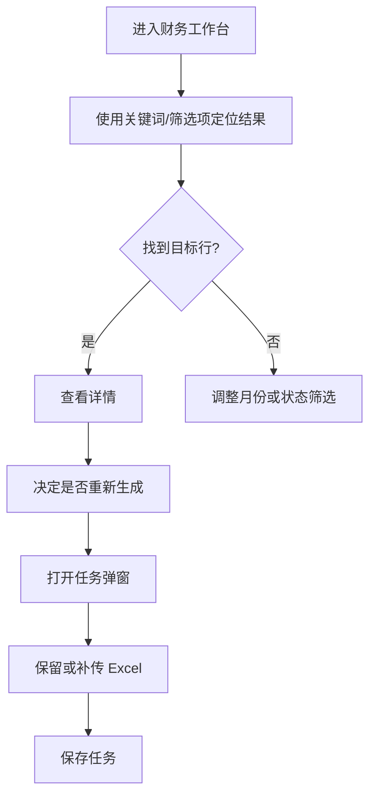

# UI/UX 规范文档

## 文档信息
- **功能名称**：财务工作台筛选收敛审计
- **版本**：1.0
- **创建日期**：2026-04-01
- **作者**：UI Designer Agent

---

## 1. 设计概述

### 1.1 设计理念
财务页应是一张“轻量工作台”，不是经营大屏。页面重点是快速定位结果和发起动作，因此要克制、稳定、低噪音。

### 1.2 设计原则
- **简洁**：去掉统计卡片和额外子页，但不删除必要的业务筛选
- **一致**：列表页复用 `SimpleTemplate`，搜索项遵循统一字段规范
- **可访问**：每个搜索项必须有明确 `label`
- **响应式**：桌面端一行展示，窄屏时允许自然换行

---

## 2. 用户流程

### 2.1 主流程



### 2.2 流程说明

| 步骤 | 页面/组件 | 用户行为 | 系统响应 |
|------|-----------|----------|----------|
| 1 | 财务工作台列表页 | 输入关键词或选择筛选项 | 更新列表结果 |
| 2 | 财务工作台列表页 | 点击“查看详情” | 打开详情抽屉 |
| 3 | 财务工作台列表页 | 点击“新建任务/重新生成” | 打开任务弹窗 |
| 4 | 财务任务弹窗 | 上传或复用 Excel | 本地保留文件 |

---

## 3. 设计令牌

### 3.1 颜色系统

#### 主色调
| 名称 | 色值 | 用途 |
|------|------|------|
| Primary | #1677FF | 搜索按钮、主要动作 |
| Primary Light | #4096FF | 悬停 |
| Primary Dark | #0958D9 | 按下 |

#### 语义色
| 名称 | 色值 | 用途 |
|------|------|------|
| Success | #22C55E | 盈利、成功状态 |
| Warning | #F59E0B | 未配置、提醒 |
| Error | #EF4444 | 亏损、危险操作 |
| Info | #06B6D4 | 已配置、信息态 |

#### 中性色
| 名称 | 色值 | 用途 |
|------|------|------|
| Gray 50 | #F8FAFC | 卡片浅底 |
| Gray 100 | #F1F5F9 | 分隔背景 |
| Gray 300 | #CBD5E1 | 边框 |
| Gray 500 | #64748B | 辅助文字 |
| Gray 700 | #334155 | 正文文字 |
| Gray 900 | #0F172A | 标题文字 |

### 3.2 排版系统

| 名称 | 大小 | 行高 | 字重 | 用途 |
|------|------|------|------|------|
| H4 | 20px | 1.4 | 600 | 弹窗/抽屉标题 |
| Body | 14px | 1.5 | 400 | 表格与表单正文 |
| Small | 12px | 1.5 | 500 | 标签、辅助说明 |

**字体族**：
- 英文：Inter / -apple-system / system-ui
- 中文：PingFang SC / Microsoft YaHei

### 3.3 间距系统

基础单位：8px

| 名称 | 值 | 用途 |
|------|-----|------|
| spacing-2 | 8px | 搜索项间距 |
| spacing-3 | 12px | 默认组件间距 |
| spacing-4 | 16px | 模块内间距 |
| spacing-5 | 20px | 容器 padding |

### 3.4 圆角

| 名称 | 值 | 用途 |
|------|-----|------|
| rounded-md | 6px | 输入框 |
| rounded-lg | 8px | 列表容器 |
| rounded-xl | 12px | 弹窗与上传卡片 |

---

## 4. 页面规范

### 4.1 页面：财务工作台

#### 布局结构
```text
+------------------------------------------------------+
| 搜索区：关键词 | 月份 | 任务状态 | 盈利状态 | 门店状态 |
+------------------------------------------------------+
| 表格头：新建任务                                     |
+------------------------------------------------------+
| 表格：任务 / 门店 / 状态 / 净利润 / 月份 / 操作       |
+------------------------------------------------------+
```

#### 响应式断点
| 断点 | 宽度 | 布局调整 |
|------|------|----------|
| 移动端 | < 900px | 搜索项自然换行 |
| 桌面 | >= 900px | 搜索项一行展示 |

#### 组件清单
| 组件 | 位置 | 说明 |
|------|------|------|
| `SimpleTemplate` | 主体 | 统一搜索区和表格区 |
| `Drawer` | 详情层 | 查看报表详情 |
| `Modal` | 任务层 | 新建任务、重新生成 |

---

## 5. 组件规范

### 5.1 搜索区

#### 搜索项
| 字段 | 组件 | 是否保留 | 说明 |
|------|------|----------|------|
| 关键词 | Input | 是 | 搜任务名、门店、报表 |
| 月份 | Select | 是 | 财务主分区 |
| 任务状态 | Select | 是 | 工作台主操作维度 |
| 盈利状态 | Select | 是 | 结果判断维度 |
| 门店配置状态 | Select | 是 | 配置缺口定位 |

#### 规范
- 所有项必须有 `label`
- 桌面端保持一行
- `搜索 / 重置` 统一放在 `suffixButton`
- 不单独放 `刷新`

### 5.2 表格

#### 变体
| 列 | 用途 |
|----|------|
| 任务 / 报表 | 主识别字段 |
| 门店 | 定位对象 |
| 状态类标签 | 快速识别风险与任务进度 |
| 净利润 | 核心结果字段 |
| 操作 | 查看详情 / 重新生成 / 删除任务 |

### 5.3 任务弹窗

#### 规范
- 上传区保留 4 类 Excel
- 文案强调“保留并复用输入”
- 不引入多余说明卡片

---

## 6. 最终建议

1. 恢复最小筛选，而不是恢复复杂筛选面板
2. 保持 `SimpleTemplate`，不要回退到手写搜索区
3. 将“极简”定义为“只保留必要字段”，而不是“删掉结构化筛选”
