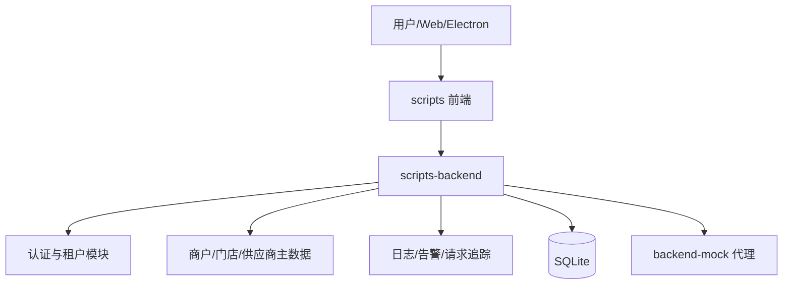
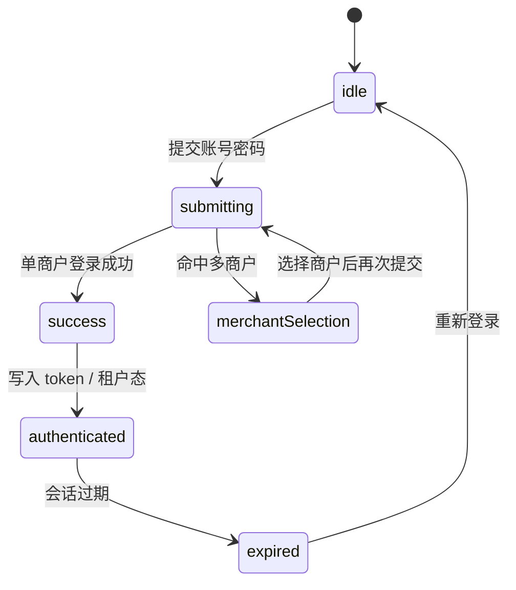

# 系统架构文档

## 1. 技术调研

### 1.1 调研背景

本项目不是新系统，而是对现有 `scripts` 代码库的前后端整合改造。当前前端仍依赖本地登录和本地数据流，后端已经具备 `Fastify + SQLite + auth + merchant/store/supplier + observability` 基础设施，但登录协议仍停留在单商户直接登录模型，无法支撑真实商户级租户上下文。

### 1.2 技术方案调研

#### 前端方案

| 方案 | 优点 | 缺点 | 结论 |
|------|------|------|------|
| 继续沿用 Vben Vue 3 + Pinia + 现有认证组件 | 与现有工程完全兼容，改造成本低 | 需要补齐登录中间态和租户态 | 采用 |
| 重写为全新前端架构 | 可以重新设计 | 成本高，风险大，且违背现有代码库前提 | 不采用 |

#### 后端方案

| 方案 | 优点 | 缺点 | 结论 |
|------|------|------|------|
| Fastify + SQLite | 轻量、结构清晰、适合本地部署和内网穿透 | 需要自己组织一些中间件能力 | 采用 |
| NestJS + PostgreSQL | 企业级、结构化强 | 当前项目改造成本过高 | 不采用 |

#### 架构结论

本期采用“前后端分离 + 独立认证服务 + 统一租户上下文”的架构。前端负责登录交互、会话恢复和租户态渲染；后端负责认证、会话、租户校验、基础主数据和统一日志/告警。

## 2. 架构概述

### 2.1 架构类型

本项目属于前后端分离的单体演进架构，不引入微服务拆分。`scripts-backend` 作为独立后端服务，承接真实认证和主数据，`scripts` 前端继续保留业务页面和 Electron 能力。

### 2.2 系统架构图



### 2.3 技术栈

| 层级 | 技术 |
|------|------|
| 前端 | Vue 3、Vben、Pinia、Vben Form、Ant Design Vue |
| 后端 | Fastify、@fastify/cookie、@fastify/cors、@fastify/jwt |
| 数据 | SQLite |
| 运维 | 结构化日志、Webhook 告警、PM2 |

## 3. 前后端交互协议

### 3.1 登录接口契约

#### `POST /api/auth/login`

请求体：

```json
{
  "username": "admin",
  "password": "******",
  "merchantId": "optional"
}
```

响应分两类：

1. 单商户或已指定商户时，直接成功。

```json
{
  "code": 0,
  "data": {
    "accessToken": "jwt",
    "id": "user-id",
    "username": "admin",
    "realName": "Admin",
    "roles": ["super_admin"],
    "role": "super_admin",
    "merchantId": "merchant-id",
    "merchantName": "oby",
    "homePath": "/dashboard/workspace"
  },
  "message": "ok",
  "error": null
}
```

2. 账号绑定多个商户但未指定 `merchantId` 时，返回待选商户中间态。

```json
{
  "code": 0,
  "data": {
    "stage": "select_merchant",
    "username": "admin",
    "realName": "Admin",
    "merchantOptions": [
      { "merchantId": "m1", "merchantName": "门店 A", "role": "merchant_admin" },
      { "merchantId": "m2", "merchantName": "门店 B", "role": "merchant_admin" }
    ]
  },
  "message": "ok",
  "error": null
}
```

### 3.2 刷新与登出

#### `POST /api/auth/refresh`

- refresh token 放在 `httpOnly cookie`
- 前端必须使用 `withCredentials: true`
- 失败时返回 403，前端统一回到登录页或弹出过期态

#### `POST /api/auth/logout`

- 服务端撤销 refresh session
- 清理 cookie
- 前端清空 accessToken、用户信息、租户态

### 3.3 当前用户与权限

#### `GET /api/user/info`

返回当前登录用户、商户和角色信息，前端用它做页面刷新恢复。

#### `GET /api/auth/codes`

返回当前用户在当前商户下的权限码，前端据此恢复路由和按钮权限。

## 4. 登录中间态

### 4.1 状态机



### 4.2 前端状态

前端需要把登录拆成两个阶段：

1. 第一阶段：输入 `username/password/captcha`。
2. 第二阶段：仅在后端返回 `select_merchant` 时展示商户选择器。

登录页不直接把“商户选择”当成默认步骤，避免单商户用户被打扰。

### 4.3 状态落点

- `accessStore.accessToken` 保存 accessToken
- `userStore.userInfo` 保存用户、角色、merchantId、merchantName、homePath
- `loginPendingState` 仅在登录页组件内暂存，不持久化
- `refreshToken` 永远不进入 JS 内存，依赖 cookie

## 5. 租户上下文

### 5.1 租户模型

本期只做商户级租户，不扩展门店级或组织树级租户。数据库通过 `user_merchants` 关联用户和商户，支持一个账号绑定多个商户。

### 5.2 持久化规则

- accessToken 由前端持有
- refreshToken 由后端 cookie 持有
- 当前商户上下文由前端 `userInfo` 持有并在刷新时从 `/api/user/info` 恢复
- 商户主数据保存在 SQLite 的 `merchants` 表中

### 5.3 切换规则

- 登录时选择商户
- 登录后本期不提供独立“切换商户中心”
- 若后续需要切换商户，必须重新走认证链路或新增独立切换接口

## 6. 后端数据与安全

### 6.1 数据表

- `users`
- `merchants`
- `user_merchants`
- `refresh_sessions`
- `stores`
- `suppliers`

### 6.2 安全策略

- 密码使用哈希存储，不保留明文
- accessToken 采用短时 JWT
- refreshToken 采用随机 opaque token + `httpOnly cookie`
- cookie 的 `sameSite` 和 `secure` 由环境配置控制
- 所有认证相关接口带请求追踪标识 `x-request-id`

### 6.3 错误处理

- 400：参数缺失或格式错误
- 401：未登录或 token 无效
- 403：密码错误、商户无权限、会话过期
- 5xx：记录结构化日志并进入告警出口

## 7. 接口变更

### 7.1 前端需要调整的点

- `loginApi` 支持多商户中间态结果
- `auth store` 识别 `select_merchant`，并支持二次提交 `merchantId`
- `refreshTokenApi`、`logoutApi` 必须把 `withCredentials` 放到请求配置里
- `getUserInfoApi` / `getAccessCodesApi` 用于刷新恢复
- 登录页需要新增商户选择交互，不再只靠单次表单提交

### 7.2 后端需要调整的点

- `POST /api/auth/login` 支持返回商户选择中间态
- `POST /api/auth/refresh` 轮换 session
- `GET /api/user/info` 支持租户恢复
- `GET /api/auth/codes` 绑定当前商户权限

## 8. 迁移步骤

1. 前端接入真实后端登录接口，先保持原登录页结构。
2. 前端 `auth store` 增加中间态判断和商户选择提交。
3. 后端登录接口返回 `select_merchant` 或直接成功两种形态。
4. 前端启动恢复流程时优先调用 `/api/user/info` 和 `/api/auth/codes`。
5. Electron 本地 `local-auth-*` 逐步收敛到 HTTP 认证。

## 9. 测试策略

### 9.1 单元测试

- 登录成功/失败
- 多商户中间态判断
- token 生成与 refresh session 轮换
- 前端 store 状态转移

### 9.2 集成测试

- `/api/auth/login`
- `/api/auth/refresh`
- `/api/auth/logout`
- `/api/user/info`
- `/api/auth/codes`
- 门店/供应商/商户主数据接口

### 9.3 E2E 测试

- 单商户账号登录后直接进入工作台
- 多商户账号登录后进入商户选择态
- 选择商户后完成登录并恢复租户上下文
- 刷新页面后能恢复会话
- 退出登录后回到登录页

## 10. 风险与对策

| 风险 | 影响 | 对策 |
|------|------|------|
| 前后端返回结构不一致 | 登录流程断裂 | 先定义中间态契约，再改前端适配 |
| refresh cookie 配置错误 | 无法恢复会话 | 在本地/内网穿透场景分别验证 `sameSite/secure` |
| Electron 与 Web 逻辑分叉 | 体验不一致 | 统一 HTTP 认证链路，逐步废弃本地桥接 |
| 多商户逻辑过早复杂化 | 交互变重 | 本期仅保留商户选择，不做切换中心 |

## 11. 结论

本期推荐方案是：前端保留现有 Vben 技术栈，在登录页和认证 store 上增加“待选商户”中间态；后端以 `scripts-backend` 为真实认证中心，统一返回用户、角色和商户上下文，并通过 SQLite 持久化会话与主数据。这样可以在不推翻现有工程的前提下，把登录交互和租户体系真正接起来。
