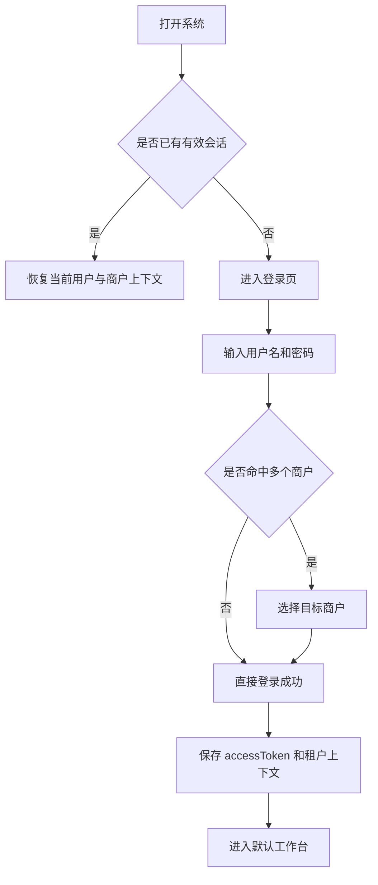

# 产品需求文档 (PRD)

## 1. 概述

- **功能名称**：登录交互与商户级租户整合
- **版本**：1.0
- **日期**：2026-03-31
- **作者**：PM Agent

## 2. 需求穿透分析（核心章节）

### 2.1 用户原始需求

> “把前端和后端结合，先把登陆交互，租户搞定”

### 2.2 需求穿透

#### 显性需求（用户明确表达的）

| 需求 | 用户原话 | 解读 |
|------|----------|------|
| 前后端联动登录 | “把前端和后端结合” | 前端不再只依赖本地模拟逻辑，需要接入真实后端认证入口 |
| 登录交互完善 | “先把登陆交互” | 登录流程不能只是账号密码提交，需覆盖状态恢复、错误提示、会话保持等完整体验 |
| 商户级租户 | “租户搞定” | 登录结果必须携带商户上下文，用户进入系统后应具备明确的商户归属 |
| 现有项目继续演进 | “现有代码库，不是新项目” | 必须在 `scripts` 既有前端与独立 `scripts-backend` 基础上迭代，不能推倒重来 |

#### 隐性需求（用户想到但未表达的）

| 需求 | 推断依据 | 为什么重要 |
|------|----------|------------|
| 登录状态可恢复 | 当前前端已有本地登录/本地数据流 | 页面刷新或重启后，用户不应反复登录 |
| Electron 与 Web 统一体验 | 项目存在 Web + Electron 双形态 | 需要避免 Web 与桌面端两套登录口径长期分叉 |
| 登录后权限与租户一致 | 已存在 role / access codes / merchantId 相关上下文 | 登录若不统一租户和权限，后续业务页面会频繁出现权限错配 |
| 兼容现有 mock 与本地数据 | 当前系统已有 mock 与本地存储 | 迁移过程中不能一次性打断现有业务使用 |

#### 潜在需求（用户尚未意识到的）

| 需求 | 洞察来源 | 预期价值 |
|------|----------|----------|
| 统一认证中心 | 后端已具备 Fastify + SQLite + auth 基础设施 | 未来采购、门店、供应商、活动中心都可复用同一认证入口 |
| 租户上下文可扩展 | 目前只要求商户级，但业务已出现门店/供应商/商户多主体 | 后续可平滑扩展到商户-门店-角色三层体系 |
| 会话与审计能力 | 真实后端开始承载认证 | 可为后续安全审计、异常登录排查、告警联动打基础 |
| 登录失败的可解释性 | 前端当前依赖本地逻辑，错误场景较分散 | 统一错误码和错误文案可降低运营与开发排查成本 |

#### 惊喜需求（超出预期的创新点）

| 需求 | 创新点 | 预期反应 |
|------|--------|----------|
| 多商户账号登录选择 | 登录后若账号绑定多个商户，可显式选择目标商户 | “不用额外找管理员改账号，体验更顺” |
| 登录后自动恢复工作台 | 成功登录后直接回到默认工作台/上次页面 | “少一步跳转，效率更高” |
| x-request-id 与登录链路串联 | 登录请求、刷新、登出都带请求追踪 | “问题定位更快，系统更专业” |
| 告警与日志可追踪 | 后端登录异常可落日志与告警出口 | “不仅能用，而且能管得住” |

### 2.3 需求优先级矩阵

```
        高价值
           │
    ┌──────┼──────┐
    │ 必做 │ 优先 │
    │ P0   │ P1   │
低成本 ────┼──── 高成本
    │ 可做 │ 谨慎 │
    │ P2   │ P3   │
    └──────┼──────┘
           │
        低价值
```

| 优先级 | 需求 | 价值 | 成本 | 决策 |
|--------|------|------|------|------|
| P0 | 真实登录/刷新/登出/用户信息接口联通 | 高 | 中 | 必须做 |
| P0 | 登录结果携带商户上下文 | 高 | 中 | 必须做 |
| P0 | 前端登录页接入真实后端并恢复会话 | 高 | 中 | 必须做 |
| P0 | 当前用户恢复逻辑统一 | 高 | 中 | 必须做 |
| P1 | 多商户账号登录选择 | 高 | 中 | 优先做 |
| P1 | 统一权限码与商户上下文联动 | 高 | 中 | 优先做 |
| P1 | Electron 与 Web 登录口径逐步收敛 | 高 | 高 | 优先做 |
| P2 | 登录成功后的页面体验优化 | 中 | 低 | 可以做 |
| P3 | 复杂租户切换中心 | 高 | 高 | 暂不做 |

### 2.4 需求范围

#### 本期做

- 前端登录页接入真实后端认证
- 前端当前用户恢复、退出、登录状态维护
- 后端以商户为租户上下文返回用户信息
- 登录后在前端落地当前商户上下文
- 对认证失败、会话过期、权限不足给出统一体验

#### 本期不做

- 不做门店/供应商/采购/活动等业务页面重构
- 不做复杂租户切换中心
- 不做多组织多层级权限后台
- 不做账号注册、找回密码、短信验证码登录

## 3. 目标用户

### 用户画像 1：运营管理员

- **基本特征**：负责门店、供应商、活动和采购工具的日常操作
- **行为特征**：高频登录，频繁切换页面，依赖系统默认工作台
- **核心需求**：快速进入系统并保持当前商户身份稳定
- **痛点场景**：登录后身份不清晰、刷新后状态丢失、切换页面需要重新确认上下文

### 用户画像 2：桌面端操作员

- **基本特征**：在 Electron 桌面端执行门店/活动/采购相关任务
- **行为特征**：连续使用时间长，对登录稳定性要求高
- **核心需求**：Web 与桌面端保持一致的登录与租户体验
- **痛点场景**：桌面端与 Web 两套登录逻辑不一致，操作心智负担高

## 4. 用户流程

### 4.1 核心流程



### 4.2 流程说明

| 步骤 | 页面/组件 | 用户操作 | 系统反馈 | 设计要点 |
|------|-----------|----------|----------|----------|
| 1 | 启动页 | 打开 Web 或桌面端 | 检查本地 token / 会话 | 尽量无感恢复 |
| 2 | 登录页 | 输入账号密码 | 显示校验与加载状态 | 不打断输入节奏 |
| 3 | 商户选择态 | 仅多商户账号可见 | 展示可访问商户列表 | 选择要明确、成本低 |
| 4 | 登录成功 | 自动跳转工作台 | 写入用户、权限、商户上下文 | 默认回到高频入口 |
| 5 | 会话过期 | 页面操作中 | 提示重新登录 | 提示要统一、可恢复 |

## 5. 功能需求

### FR-001：真实登录接入

- **需求描述**：前端登录页接入 `scripts-backend` 的真实认证接口，支持用户名密码登录。
- **用户价值**：用户可以直接使用真实账号完成系统登录，不再依赖本地模拟。
- **优先级**：P0
- **需求来源**：显性
- **验收标准**：
  - [ ] 登录页可向后端发送账号密码请求
  - [ ] 登录成功后保存 accessToken 与用户信息
  - [ ] 登录失败能显示统一错误文案
  - [ ] 刷新页面后能恢复登录状态

### FR-002：商户级租户上下文

- **需求描述**：登录成功后，系统必须明确当前用户所属商户，并将商户信息写入前端全局状态。
- **用户价值**：用户始终知道自己在操作哪个商户，避免跨商户误操作。
- **优先级**：P0
- **需求来源**：显性 / 隐性
- **验收标准**：
  - [ ] 登录返回包含 `merchantId` 与 `merchantName`
  - [ ] 前端全局状态中存在当前商户上下文
  - [ ] 门店/供应商/活动等页面可以读取商户上下文
  - [ ] 退出登录时商户上下文一并清空

### FR-003：当前用户恢复

- **需求描述**：系统启动或刷新后，优先尝试恢复当前用户、权限和商户信息。
- **用户价值**：减少重复登录，提升连续使用体验。
- **优先级**：P0
- **需求来源**：隐性
- **验收标准**：
  - [ ] 页面刷新后无需重新输入账号密码即可恢复会话
  - [ ] 会话失效时能自动回到登录页
  - [ ] 恢复时同时恢复权限码与商户上下文

### FR-004：多商户账号登录选择

- **需求描述**：当一个账号可访问多个商户时，登录过程需要支持目标商户选择。
- **用户价值**：减少账号拆分与重复维护，提升灵活性。
- **优先级**：P1
- **需求来源**：潜在
- **验收标准**：
  - [ ] 多商户账号登录时能够展示可选商户
  - [ ] 选择后登录结果带上指定商户上下文
  - [ ] 若只绑定一个商户，则不额外打断登录流程

### FR-005：Web 与 Electron 登录体验统一

- **需求描述**：前端 Web 与 Electron 桌面端最终使用同一套登录与租户逻辑。
- **用户价值**：降低学习成本，避免两套系统两种心智。
- **优先级**：P1
- **需求来源**：隐性 / 惊喜
- **验收标准**：
  - [ ] 两端登录返回结构一致
  - [ ] 两端权限与商户上下文一致
  - [ ] 未来迁移不需要重写一套认证流程

### FR-006：统一错误与告警

- **需求描述**：登录、刷新、登出、用户信息等认证链路需要统一错误处理、日志与告警出口。
- **用户价值**：提升稳定性，便于问题定位与运维接管。
- **优先级**：P1
- **需求来源**：潜在
- **验收标准**：
  - [ ] 认证链路异常可记录结构化日志
  - [ ] 5xx 或未捕获异常可以进入告警
  - [ ] 所有接口响应至少带请求追踪标识

## 6. 交互设计原则

- 登录流程保持短链路，默认只暴露账号密码输入
- 多商户选择只在必要时出现，不打扰单商户用户
- 成功登录后直接进入工作台，不增加额外确认页
- 错误提示统一中文文案，避免暴露技术细节
- 过期会话必须可恢复，避免用户丢失当前上下文

## 7. 验收标准

### 7.1 登录闭环

- [ ] 前端可通过真实后端登录成功
- [ ] 登录失败提示一致且可读
- [ ] 刷新页面后仍可恢复登录状态
- [ ] 退出登录后本地状态和后端会话都清除

### 7.2 租户闭环

- [ ] 登录结果包含商户信息
- [ ] 当前商户在前端全局状态可被业务页面读取
- [ ] 用户进入任意系统页面时都能感知当前商户
- [ ] 多商户账号登录流程可选定目标商户

### 7.3 稳定性闭环

- [ ] 认证请求、恢复请求、登出请求可追踪
- [ ] 后端访问日志可记录关键请求
- [ ] 认证异常可被告警链路捕获
- [ ] Web 与 Electron 不再使用两套完全割裂的登录语义

## 8. 风险与约束

| 风险 | 影响 | 规避策略 |
|------|------|----------|
| 前端与后端登录返回结构不一致 | 登录状态难以统一 | 先定义兼容字段，前后端同步验收 |
| 多商户逻辑过早复杂化 | 交互变重，开发成本升高 | 本期只做商户级，不扩展到多层租户切换中心 |
| Electron 与 Web 双链路分叉 | 用户体验不一致 | 优先统一认证协议，再逐步收敛实现 |
| 会话与本地缓存不一致 | 刷新后状态异常 | 明确 accessToken、refreshToken 与前端 store 的职责边界 |

## 9. 里程碑建议

1. 完成真实登录、刷新、退出、用户信息接口对接
2. 完成前端登录页与当前用户恢复
3. 完成商户级租户上下文落地
4. 完成多商户账号登录选择
5. 完成 Web 与 Electron 登录语义统一

