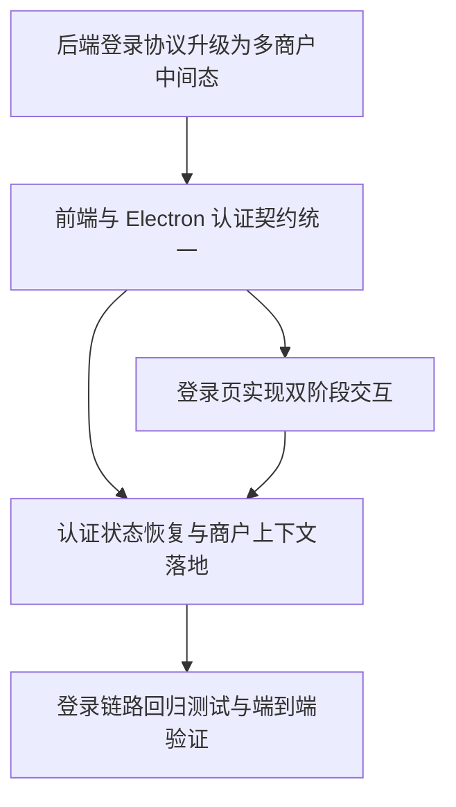

# 开发任务规格文档

## 故事引用
- **Story ID**：登录交互与商户级租户整合
- **故事标题**：前后端登录交互与商户级租户整合

## 任务列表

### Task T-001：后端登录协议升级为多商户中间态

**类型**：修改

**目标文件**：
| 文件路径 | 操作 | 说明 |
|----------|------|------|
| `/Users/mac/Documents/GitHub/scripts-backend/src/routes/auth.ts` | 修改 | `POST /api/auth/login` 支持单商户直登和多商户待选两种返回形态 |
| `/Users/mac/Documents/GitHub/scripts-backend/src/auth.ts` | 修改 | 补充登录结果标准化、商户候选列表、按商户签发会话的逻辑 |
| `/Users/mac/Documents/GitHub/scripts-backend/test/auth.test.ts` | 修改 | 增加多商户登录、指定商户登录、无权限商户和回归测试 |

**实现步骤**：
1. 将登录响应拆成两个稳定分支：
   - 单商户或已传 `merchantId` 时，直接返回 `accessToken`、`merchantId`、`merchantName`、`roles`
   - 多商户且未传 `merchantId` 时，返回 `stage = select_merchant` 和 `merchantOptions`
2. `merchantOptions` 至少包含 `merchantId`、`merchantName`、`role`、`isDefault`，并保证默认商户排在首位。
3. 保持现有 `/api/auth/refresh`、`/api/auth/logout`、`/api/user/info`、`/api/auth/codes` 兼容，避免打断已登录用户。
4. 登录失败、商户无权限、会话过期继续使用统一中文错误文案和 403 状态码。

**测试用例**：
文件：`/Users/mac/Documents/GitHub/scripts-backend/test/auth.test.ts`
- [ ] 单商户账号登录后直接返回 `accessToken`
- [ ] 多商户账号未传 `merchantId` 时返回 `select_merchant`
- [ ] 选择指定 `merchantId` 后可成功登录并落入对应商户上下文
- [ ] 无权限商户返回 403 且不会签发会话
- [ ] refresh / logout / user info / codes 保持回归通过

**复杂度**：中

**依赖**：无

**注意事项**：
- 返回结构要兼容现有前端的 `success / user / message` 解析路径，避免一次性把旧登录流打断。
- `merchantOptions` 只解决“登录时选哪个商户”，不要在这一层引入独立的商户切换中心。

### Task T-002：前端与 Electron 认证契约统一

**类型**：修改

**目标文件**：
| 文件路径 | 操作 | 说明 |
|----------|------|------|
| `/Users/mac/Documents/GitHub/scripts/apps/web-antd/src/api/core/auth.ts` | 修改 | 登录结果类型改成统一联合类型，识别 `select_merchant` 中间态 |
| `/Users/mac/Documents/GitHub/scripts/apps/web-antd/src/api/request.ts` | 修改 | 修正 refresh/logout 的请求配置，确保 `withCredentials` 进入 axios config |
| `/Users/mac/Documents/GitHub/scripts/apps/web-antd/electron/main.ts` | 修改 | 让 `local-auth-*` IPC 代理到 `scripts-backend` 的真实 HTTP 接口 |
| `/Users/mac/Documents/GitHub/scripts/apps/web-antd/electron/features/auth/index.ts` | 修改 | 将本地 JSON 用户存储逻辑收敛为后端认证的辅助实现或种子适配层 |

**实现步骤**：
1. 在 `AuthApi` 里定义登录联合结果：
   - 成功登录结果
   - `stage = select_merchant` 的待选商户结果
2. `loginApi` 对 Web 与 Electron 统一返回标准化结果，不直接把后端原始 payload 暴露给调用方。
3. 修正 `refreshTokenApi` 与 `logoutApi` 的 `withCredentials` 传参位置，避免 cookie 无法送达后端。
4. Electron 主进程中的 `local-auth-login / logout / get-user-info / get-access-codes` 继续保留 IPC 入口，但内部改为请求真实后端，不再依赖本地明文用户文件。

**测试用例**：
文件：`/Users/mac/Documents/GitHub/scripts/apps/web-antd/src/api/core/__tests__/auth.test.ts`
- [ ] Web 端登录成功与待选商户结果都能被标准化解析
- [ ] `refreshTokenApi` 与 `logoutApi` 请求配置携带 cookie
- [ ] Electron 场景下 IPC 仍返回同样的登录结果结构
- [ ] 异常响应可落入统一错误分支

**复杂度**：高

**依赖**：T-001

**注意事项**：
- 这一层是“前后端协议的桥”，不要把 UI 交互逻辑写进 API 适配层。
- Electron 先保留 IPC 入口，避免把整个桌面端登录链路一次性掀翻。

### Task T-003：登录页实现双阶段交互

**类型**：修改 / 新增

**目标文件**：
| 文件路径 | 操作 | 说明 |
|----------|------|------|
| `/Users/mac/Documents/GitHub/scripts/apps/web-antd/src/views/_core/authentication/login.vue` | 修改 | 把单步登录升级为账号密码阶段 + 商户选择阶段 |
| `/Users/mac/Documents/GitHub/scripts/apps/web-antd/src/views/_core/authentication/components/merchant-selector.vue` | 新增 | 商户选择卡片/列表组件，承载多商户待选态 |
| `/Users/mac/Documents/GitHub/scripts/apps/web-antd/src/views/_core/authentication/components/login-stage-switcher.vue` | 新增 | 管理阶段切换、返回重填、加载态与空态文案 |

**实现步骤**：
1. 保留现有 `AuthenticationLogin` 外壳与视觉体系，不重做整张登录页。
2. 第一步只负责 `username / password / captcha`，成功后根据后端结果决定是否进入第二阶段。
3. 若后端返回 `select_merchant`，在同一张卡片内渲染商户列表、默认商户标识、返回修改账号密码按钮和确认进入按钮。
4. 商户列表默认单选，确认前禁止重复提交；若列表为空，展示无权限空态。
5. 阶段切换时保留用户名，默认清空密码，避免用户回退后误以为已经提交成功。

**测试用例**：
文件：`/Users/mac/Documents/GitHub/scripts/apps/web-antd/src/views/_core/authentication/__tests__/login.test.ts`
- [ ] 单商户登录时只出现第一阶段
- [ ] 多商户返回时出现第二阶段商户选择
- [ ] 返回按钮能回到第一阶段并保留用户名
- [ ] 确认进入按钮只有在选择商户后可用
- [ ] 空态和错误态文案正确显示

**复杂度**：高

**依赖**：T-001、T-002

**注意事项**：
- 新增商户选择组件时，优先复用现有认证页的间距、按钮和标题层级，避免视觉风格断裂。
- 不要把商户选择做成复杂表格，保持“单次登录任务”的轻量感。

### Task T-004：认证状态恢复与商户上下文落地

**类型**：修改

**目标文件**：
| 文件路径 | 操作 | 说明 |
|----------|------|------|
| `/Users/mac/Documents/GitHub/scripts/apps/web-antd/src/store/auth.ts` | 修改 | 处理两阶段登录结果、会话恢复、商户上下文写入与清理 |
| `/Users/mac/Documents/GitHub/scripts/apps/web-antd/src/router/guard.ts` | 修改 | 确保刷新恢复、登录跳转和默认工作台回跳都与商户上下文一致 |
| `/Users/mac/Documents/GitHub/scripts/apps/web-antd/src/api/core/user.ts` | 修改 | 恢复当前用户时确保 merchantId / merchantName 一并回填 |

**实现步骤**：
1. `authLogin` 需要同时处理两种结果：
   - 直接登录成功
   - 返回 `select_merchant` 并等待第二阶段确认
2. `fetchUserInfo` 必须在页面刷新后恢复用户、角色、商户与默认工作台路径。
3. `logout` 清空 accessToken、userInfo、merchantId、merchantName 和登录过期标记，避免租户残留。
4. 路由守卫保持现有动态路由生成逻辑，但要确保恢复场景下不会把用户误踢回登录页。

**测试用例**：
文件：`/Users/mac/Documents/GitHub/scripts/apps/web-antd/src/store/__tests__/auth.test.ts`
- [ ] 直接登录成功后 userInfo 中包含 merchantId / merchantName
- [ ] 多商户待选态不会写入最终登录态
- [ ] 刷新后可通过 `fetchUserInfo` 恢复会话
- [ ] 退出登录后商户上下文被彻底清空

**复杂度**：中

**依赖**：T-002、T-003

**注意事项**：
- 这里的核心不是“保存更多字段”，而是保证登录态、租户态、权限态三者同步一致。
- `loginExpired` 模态和自动退出逻辑要保留，避免会话过期时出现静默失效。

### Task T-005：登录链路回归测试与端到端验证

**类型**：新增 / 修改

**目标文件**：
| 文件路径 | 操作 | 说明 |
|----------|------|------|
| `/Users/mac/Documents/GitHub/scripts-backend/test/auth.test.ts` | 修改 | 增加多商户登录、merchantId 二次登录、session 恢复回归 |
| `/Users/mac/Documents/GitHub/scripts/apps/web-antd/src/views/_core/authentication/__tests__/login.test.ts` | 新增 | 覆盖登录页双阶段交互 |
| `/Users/mac/Documents/GitHub/scripts/apps/web-antd/src/store/__tests__/auth.test.ts` | 新增 | 覆盖会话恢复、商户上下文、登出清理 |
| `/Users/mac/Documents/GitHub/scripts/apps/web-antd/e2e/login-tenant.spec.ts` | 新增 | 覆盖真实登录、商户选择、刷新恢复、退出登录主路径 |

**实现步骤**：
1. 后端测试覆盖单商户、多商户、无权限商户、refresh/logout 和 user info 恢复。
2. 前端单测覆盖登录页阶段切换、auth store 状态流转和错误态。
3. E2E 覆盖完整用户路径：
   - 打开登录页
   - 输入账号密码
   - 多商户时选择商户
   - 进入工作台
   - 刷新后恢复
   - 退出后回到登录页
4. 任何一个核心测试失败都不能进入后续交付。

**测试用例**：
- [ ] 后端登录协议测试通过
- [ ] 前端登录状态机测试通过
- [ ] E2E 核心路径在 Web 环境通过
- [ ] Electron 场景至少完成一次 smoke 验证

**复杂度**：中

**依赖**：T-001、T-002、T-003、T-004

**注意事项**：
- 这里的 E2E 不是走过场，必须能真实验证“登录 -> 选商户 -> 进入工作台 -> 刷新恢复 -> 退出”。
- 如果测试里发现协议不一致，优先回到 T-001 / T-002 修协议，不要在测试里硬凑兼容。

## 任务依赖图

## 实现前检查清单

- [ ] 已确认后端登录协议包含 `select_merchant` 中间态
- [ ] 已确认前端登录页仍基于现有 `AuthenticationLogin` 外壳改造
- [ ] 已确认 Electron 场景不会被一次性断开
- [ ] 已确认测试覆盖登录、选商户、刷新恢复、退出四条主路径
- [ ] 已确认所有任务都可在 1-2 个开发迭代内拆解执行

