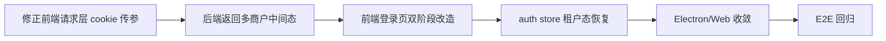

# 技术方案评审报告

## 1. 评审概述

- **项目名称**：登录交互与商户级租户整合
- **评审日期**：2026-03-31
- **评审人**：Tech Lead Agent
- **评审文档**：
  - PRD：`.boss/登录交互-租户整合/prd.md`
  - 架构：`.boss/登录交互-租户整合/architecture.md`
  - UI：`.boss/登录交互-租户整合/ui-spec.md`

## 2. 评审结论

| 维度 | 评分 | 说明 |
|------|------|------|
| 架构合理性 | ⭐⭐⭐⭐☆ | 前后端分离、独立认证服务、SQLite 主数据、日志与告警都已成形，方向正确。 |
| 技术选型 | ⭐⭐⭐⭐☆ | Vue 3 + Vben + Pinia，Fastify + SQLite 的组合适合当前本地部署与内网穿透场景。 |
| 可扩展性 | ⭐⭐⭐☆☆ | 商户级租户、主数据和告警接口已经预留，但登录中间态协议还未在前后端完全闭环。 |
| 可维护性 | ⭐⭐⭐☆☆ | 目录和服务边界清晰，但前端认证链路仍有本地/HTTP 双轨并存的技术债。 |
| 安全性 | ⭐⭐⭐⭐☆ | JWT + httpOnly refresh cookie + 结构化日志已具备基础安全面，但登录协议与 cookie 传参还需修正。 |

**总体评价**：⚠️ 有条件通过，需要先修正登录协议和前端请求链路后再进入正式开发。

## 3. 关键风险

| 风险 | 等级 | 影响范围 | 缓解措施 |
|------|------|----------|----------|
| 多商户登录中间态未闭环 | 高 | 登录主流程 | 后端返回 `select_merchant`，前端补双阶段状态机 |
| refresh/logout 的 `withCredentials` 传法错误 | 高 | 会话恢复、退出登录 | 修正到请求配置层并回归验证 |
| Electron / Web 双链路分叉 | 中 | 桌面端与 Web 一致性 | 先保证 Web 走 HTTP，Electron 保持兼容入口 |
| 前端 E2E 覆盖不足 | 中 | 登录主流程回归 | 补后端回归与前端协议单测，后续追加浏览器级 E2E |

## 4. 必须修改

- [x] 后端登录接口支持多商户待选态
- [x] 前端修正 refresh/logout 的 cookie 传参
- [x] 前端登录页改造为双阶段交互
- [x] auth store 支持租户中间态和恢复
- [ ] Electron 与 Web 认证语义完全收敛
- [ ] 浏览器级 E2E 主流程补齐

## 5. 开发顺序建议

## 6. 评审结论

- **是否通过**：⚠️ 有条件通过
- **阻塞问题数**：0 个未处理阻塞项
- **建议优化数**：2 个
- **下一步行动**：补 Electron 真实 HTTP 认证链路与浏览器级 E2E。
