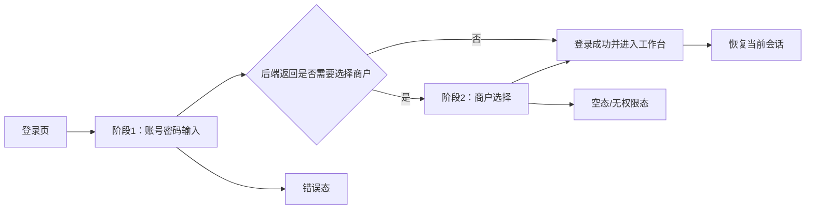
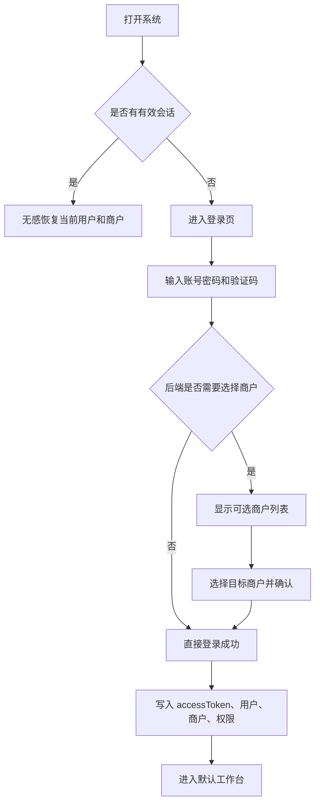

# UI/UX 设计规范文档

## 1. 设计概述

### 1.1 基本信息

- **功能名称**：登录交互与商户级租户整合
- **设计版本**：1.0
- **日期**：2026-03-31
- **设计师**：UI Designer Agent

### 1.2 设计理念

> 在不改变现有认证页面体系的前提下，把“登录”从一次性提交，升级为可感知状态、可恢复上下文、可选择租户的连续任务。

### 1.3 设计目标

| 目标 | 描述 | 衡量标准 |
|------|------|----------|
| 易用性 | 账号密码登录保持单步完成，多商户时才出现额外选择 | 单商户登录不增加额外操作 |
| 一致性 | Web 与 Electron 保持同一套交互语义 | 两端登录流程与文案一致 |
| 可恢复性 | 刷新、重启、会话过期后能明确恢复或重新登录 | 用户知道当前所处状态 |
| 可解释性 | 错误、无权限、多租户场景都有明确反馈 | 不出现“静默失败” |
| 扩展性 | 保留现有 `AuthenticationLogin` 认证壳 | 前端改造集中在登录页与状态管理层 |

## 2. 信息架构

### 2.1 页面结构

```
认证页
├── 登录阶段 1：账号密码输入
│   ├── 用户名
│   ├── 密码
│   ├── 验证码
│   ├── 记住用户名
│   └── 登录按钮
├── 登录阶段 2：商户选择
│   ├── 当前账号信息
│   ├── 商户列表
│   ├── 默认商户标识
│   ├── 返回修改账号密码
│   └── 确认进入
└── 结果反馈层
    ├── 加载态
    ├── 错误态
    ├── 空态
    └── 会话恢复态
```

### 2.2 导航结构



## 3. 用户流程

### 3.1 核心流程



### 3.2 状态流转

| 状态 | 触发条件 | 页面表现 | 用户可执行操作 |
|------|----------|----------|----------------|
| 初始态 | 首次打开登录页 | 显示账号密码表单 | 输入、切换验证码、提交 |
| 提交中 | 点击登录按钮后 | 按钮 loading，表单禁用 | 等待结果 |
| 商户选择态 | 账号绑定多个商户 | 显示商户列表与确认按钮 | 选择商户、返回重填 |
| 登录成功态 | 获得 accessToken | 自动跳转工作台 | 无需操作 |
| 无权限态 | 账号无可用商户 | 显示明确空态 | 返回登录或联系管理员 |
| 错误态 | 密码错误/网络异常 | 表单或卡片级错误提示 | 重试、修改输入 |
| 恢复态 | 页面已有有效会话 | 显示短暂加载后进入工作台 | 无需操作 |

## 4. 视觉规范

### 4.1 设计语言

- 保持现有 Vben 认证页的整体风格，不重新发明视觉系统
- 在同一张认证卡片内完成两阶段交互，避免跳页造成认知切换
- 使用清晰的层级与留白，让“账号输入”和“商户选择”成为两个明确任务
- 商户选择态要比登录态更“任务化”，减少装饰性元素

### 4.2 色彩建议

| 用途 | 建议 |
|------|------|
| 主操作 | 维持现有品牌主色，用于登录、确认进入 |
| 强调信息 | 默认商户、当前账号、已选中状态 |
| 成功态 | 登录成功、已绑定、可进入 |
| 警示态 | 会话失效、无可用商户、网络异常 |
| 次要文字 | 说明文案、辅助提示、返回链接 |

### 4.3 布局建议

- 登录页采用单卡片中心布局，桌面端保持居中，移动端自适应铺满安全边距
- 阶段 1 与阶段 2 使用同一容器宽度，避免页面抖动
- 商户列表建议采用纵向卡片或可点击列表项，不建议使用复杂表格
- 关键 CTA 始终固定在卡片底部，减少用户寻找成本

## 5. 组件与交互

### 5.1 阶段 1：账号密码输入

#### 组件结构

- 标题区
- 说明区
- 用户名输入框
- 密码输入框
- 验证码校验项
- 记住用户名
- 登录按钮
- 辅助入口区

#### 交互要求

- 用户名和密码默认保留当前 `AuthenticationLogin` 的语义
- 登录按钮点击后立即进入提交中状态，禁止重复提交
- 验证码未通过时，必须在表单项内给出明确提示
- `记住用户名` 只保存用户名，不保存密码
- 登录成功后不在阶段 1 展示二次确认，除非后端要求选择商户

#### 文案建议

| 区域 | 文案 |
|------|------|
| 主标题 | 欢迎回来 |
| 副标题 | 输入账号信息后进入你的商户工作台 |
| 用户名提示 | 请输入用户名 |
| 密码提示 | 请输入密码 |
| 验证码提示 | 请先完成验证 |
| 登录按钮 | 登录 |

### 5.2 阶段 2：商户选择

#### 进入条件

- 后端登录结果返回多个可用商户
- 当前账号无法自动确定唯一商户上下文

#### 组件结构

- 返回区
- 账号摘要区
- 说明区
- 商户列表区
- 底部操作区

#### 商户卡片规范

每个商户条目至少展示：

- 商户名称
- 商户编码或简称
- 默认商户标识
- 当前账号可访问提示

建议补充展示：

- 商户状态
- 简短说明，如“推荐默认商户”

#### 交互要求

- 商户项默认单选
- 若后端提供默认商户，则默认高亮该项
- 选择商户后，确认按钮可点击
- 用户可返回阶段 1 修改账号密码重新登录
- 列表过长时允许滚动，但底部操作区保持可见
- 每次进入该阶段，必须清空上一次的商户选择结果

#### 文案建议

| 区域 | 文案 |
|------|------|
| 主标题 | 选择登录商户 |
| 副标题 | 你的账号可访问多个商户，请选择本次进入的目标商户 |
| 返回按钮 | 返回修改账号密码 |
| 确认按钮 | 确认进入 |
| 默认标签 | 默认商户 |
| 辅助提示 | 选择后将作为本次登录的商户上下文 |

### 5.3 错误态

#### 账号密码错误

- 显示在登录按钮上方的统一错误提示
- 文案建议：`用户名或密码错误，请重新输入`
- 不清空用户名，保留密码输入框为空

#### 网络异常

- 文案建议：`网络异常，请检查连接后重试`
- 保留当前表单内容，允许用户直接重试

#### 会话失效

- 页面内统一提示：`登录状态已过期，请重新登录`
- 若发生在工作台内，回跳登录页时保持原路径信息

#### 无可用商户

- 阶段 2 使用空态卡片
- 文案建议：`当前账号没有可用商户，请联系管理员`
- 提供返回登录按钮

### 5.4 加载态

- 阶段 1 提交后，登录按钮显示 loading
- 阶段 2 拉取商户列表时，列表区域显示骨架屏或局部 loading
- 页面初始化恢复会话时，整个认证卡片可显示轻量加载态，避免闪烁
- 加载态文案尽量短，避免让用户误判为卡死

### 5.5 空态

| 场景 | 空态表现 | 行动按钮 |
|------|----------|----------|
| 无有效会话 | 显示登录表单 | 无 |
| 无可用商户 | 显示无权限说明 | 返回登录 |
| 商户列表为空 | 显示系统异常或权限缺失 | 返回登录 / 联系管理员 |

## 6. 响应式与状态

### 6.1 桌面端

- 使用中心卡片布局，保证认证信息层级清晰
- 商户列表可使用更宽卡片，展示更多辅助信息
- 底部操作按钮水平排列，返回按钮弱化，确认按钮突出

### 6.2 移动端

- 认证卡片改为近全宽，减少左右留白
- 商户列表改为单列纵向列表
- 返回按钮和确认按钮垂直堆叠，确保 44px 以上触控目标

### 6.3 状态切换

- 阶段切换必须保持平滑，不闪白、不跳出卡片容器
- 阶段 1 到阶段 2 可使用轻微淡入或位移动画
- 错误提示不建议使用强烈动效，避免干扰重试

## 7. 无障碍要求

- 表单项必须支持键盘导航
- 当前选中商户需要有明确焦点与视觉选中态
- 错误信息必须可被屏幕阅读器识别
- 主按钮与辅助按钮对比度需足够
- 输入框、按钮、列表项触控面积满足基本可点击要求

## 8. 文案规范

### 8.1 登录阶段

- 统一使用简短明确的中文文案
- 避免“失败了”“不行”等口语化提示
- 错误文案优先说原因，不直接暴露技术实现

### 8.2 商户选择阶段

- 用“选择登录商户”而不是“切换租户”
- 用“确认进入”而不是“提交”
- 用“返回修改账号密码”而不是“上一步”

### 8.3 推荐文案集

| 场景 | 推荐文案 |
|------|----------|
| 页面标题 | 欢迎回来 |
| 登录副标题 | 输入账号信息后进入你的商户工作台 |
| 商户选择标题 | 选择登录商户 |
| 错误提示 | 用户名或密码错误，请重新输入 |
| 会话过期 | 登录状态已过期，请重新登录 |
| 无可用商户 | 当前账号没有可用商户，请联系管理员 |

## 9. 设计验收标准

- [ ] 单商户账号登录时，不出现商户选择中间态
- [ ] 多商户账号登录时，进入商户选择态并可完成登录
- [ ] 登录页保留现有认证页面体系，不引入新的独立页面风格
- [ ] 错误、加载、空态都有明确中文反馈
- [ ] 返回修改账号密码后，表单内容与状态可继续编辑
- [ ] Web 与 Electron 在视觉与交互上保持同一语义

## 10. 备注

- 这次设计以“最小改动、最大一致性”为原则，优先复用现有 `AuthenticationLogin` 组件和认证页结构
- 商户选择只作为登录中的必要中间态，不扩展成独立的租户管理中心
- 若后续需要支持登录后切换商户，可在本规范之上再补一版“租户切换中心”设计
