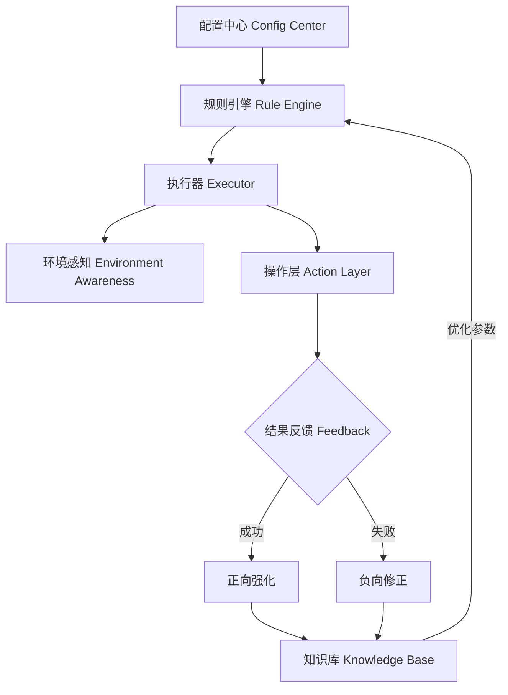

# 饿了么自动提现脚本自我进化与增强方案

本文档旨在全面评估现有脚本，并提出一套完整的自我进化、风控适应与功能增强方案。

## 1. 现有代码质量与功能完整性评估

### 1.1 代码质量审计
- **结构问题**: 当前 `src/index.ts` 为单文件脚本，逻辑（配置、页面操作、业务流程）高度耦合。难以维护和扩展。
- **异常处理**: 使用了基本的 `try-catch`，但缺乏细粒度的错误分类（如网络错误 vs 业务错误）。一旦发生未捕获异常，进程直接退出。
- **日志记录**: 仅使用 `console.log`，缺乏结构化（JSON）、分级（INFO/WARN/ERROR）和持久化能力，不利于自动化分析。
- **安全性**: **高危**。密码硬编码在源码中 (`password: '130816'`)。
- **性能**: 串行处理多个店铺。如果店铺数量多，耗时线性增长。
- **可维护性**: 选择器硬编码，UI 变更需修改源码。

### 1.2 功能完整性差距分析
| 功能模块 | 现状 | 缺失/待增强 |
| :--- | :--- | :--- |
| **多账号管理** | 不支持（仅单账号多店铺） | 支持多账号登录、Cookie 隔离、并发执行 |
| **提现策略** | 无（仅全额提现） | 最小提现金额、保留余额、定时提现、金额分批 |
| **风控规避** | 仅移除 `webdriver` 属性 | 指纹随机化（UA/Canvas/WebGL）、行为模拟（鼠标轨迹/随机延迟）、IP 代理池 |
| **失败重试** | 仅简单的循环重试 | 指数退避重试、故障转移（切换节点/IP）、人工介入通知 |
| **数据统计** | 无 | 成功率统计、金额统计、耗时分析、收益报表 |
| **配置管理** | 硬编码 | 配置文件（YAML/JSON）、环境变量、热更新 |

---

## 2. 自我进化框架设计 (Self-Evolving Framework)

核心理念：脚本不仅是执行者，也是观察者和学习者。通过记录每次执行的上下文（Context）、动作（Action）和结果（Outcome），不断优化决策模型。

### 2.1 架构设计

### 2.2 核心模块
1.  **知识库 (Knowledge Base)**:
    -   存储：`SQLite` 或 `JSON` 文件。
    -   内容：选择器成功率、最佳等待时间、风控触发时间点、验证码出现频率。
2.  **规则引擎 (Rule Engine)**:
    -   基于知识库动态调整策略。例如：如果最近 3 次在 10:00 提现触发风控，则自动调整至 10:15。
3.  **热更新机制**:
    -   监听配置文件变化，实时重载配置，无需重启进程。

---

## 3. 智能风控适应 (Smart Anti-Detection)

### 3.1 行为指纹随机化
-   **User-Agent 池**: 每次启动随机选择 Chrome (Mac) 不同版本的 UA，模拟真实 Mac 用户。
-   **鼠标轨迹**: 使用 `ghost-cursor` 或自定义贝塞尔曲线算法模拟真实人类鼠标移动，避免直线跳转。
-   **输入模拟**: 随机按键间隔（50ms - 200ms），偶尔模拟输入错误并回退。

### 3.2 自动降级与恢复
-   **触发检测**: 监控页面是否出现“滑块验证”、“频繁操作”提示。
-   **降级策略**:
    -   Level 1: 增加操作间隔（+50%）。
    -   Level 2: 暂停运行 30 分钟。
    -   Level 3: 切换 IP 或通知人工介入。

---

## 4. 监控与告警体系

### 4.1 实时日志聚合
-   引入 `winston` 或 `pino` 日志库。
-   日志格式：`{ timestamp, level, module, store, action, duration, result, error_code }`。

### 4.2 告警通道
-   **策略**: 连续失败 3 次、金额异常（为 0 或过大）、Cookie 失效。
-   **渠道**:
    -   Email (SMTP)
    -   Webhook (飞书/钉钉/Slack/Telegram)

---

## 5. 数据驱动优化与可视化

### 5.1 数据模型
记录每一笔提现详情：
-   `transaction_id`: UUID
-   `store_name`: 店铺名
-   `amount`: 提现金额
-   `status`: SUCCESS / FAIL / BLOCKED
-   `duration_ms`: 耗时
-   `retry_count`: 重试次数
-   `timestamp`: 时间戳

### 5.2 报表生成
-   定期（每日/每周）生成 HTML/Markdown 报表，展示成功率趋势和收益统计。

---

## 6. 安全与合规

-   **敏感信息加密**: 使用 `dotenv` + `AES` 加密存储密码。
-   **硬件指纹隔离**: 不同账号使用不同的浏览器指纹配置。
-   **一键数据清除**: 提供 `npm run clean:data` 命令清除所有日志和本地存储。

---

## 7. 实施路线图

见 `SELF_LEARNING_PLAN.md`。
